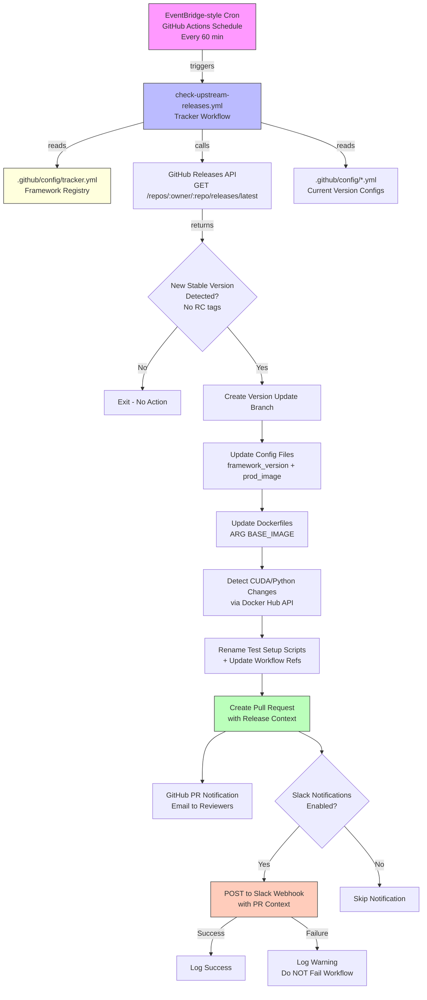
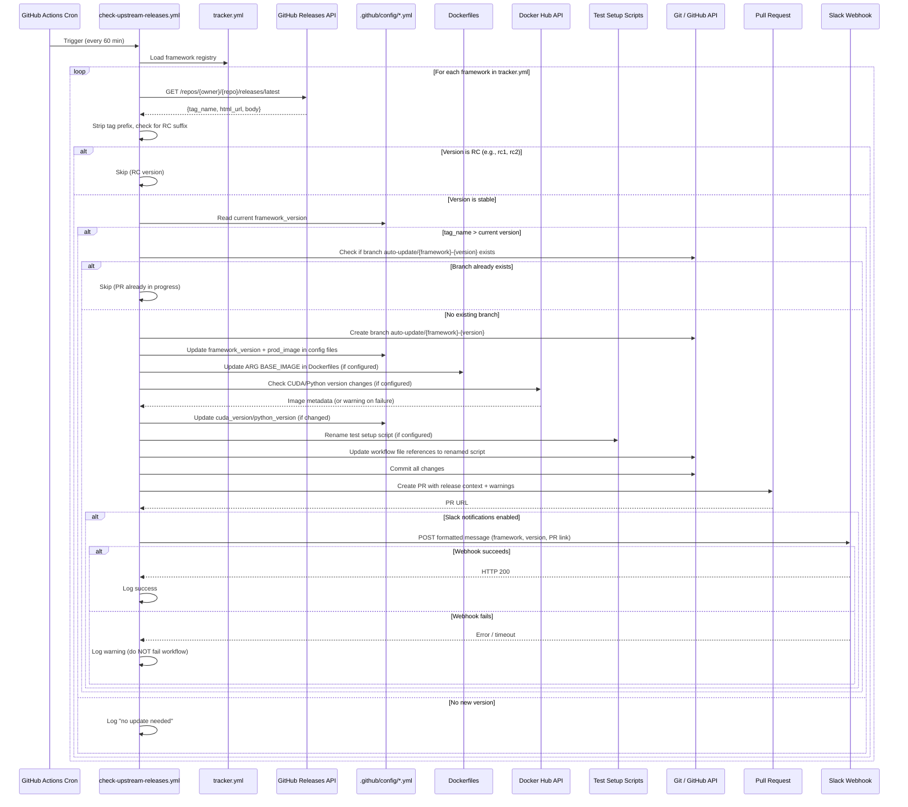
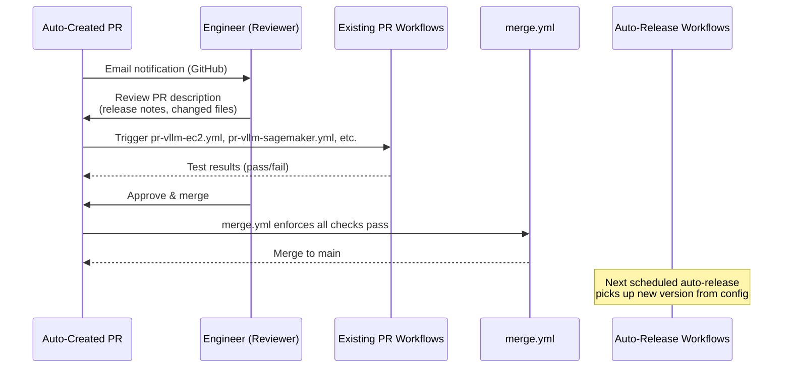

# Design Document: Auto Upstream Release Tracker

## Overview

The Auto Upstream Release Tracker automates the detection of new upstream framework releases (starting with vLLM and SGLang) and creates pull requests to update the corresponding version configurations in the `deep-learning-containers` repository. Today, engineers manually monitor GitHub repositories for new release tags, update `.github/config/*.yml` files, and create PRs — a repetitive process that delays customer access to the latest framework versions.

This system introduces a new GitHub Actions workflow that runs on a cron schedule (every 60 minutes), polls the GitHub Releases API for each tracked framework, compares the latest release tag against the current `framework_version` in the config files, and — when a new version is detected — automatically creates a PR that updates all relevant config files for that framework. Engineers receive email notifications via GitHub's existing PR notification system and can review PRs with full context (release notes link, changed configs, upstream changelog).

The design is framework-agnostic: adding a new framework requires only a new entry in a central tracker configuration file — no workflow or code changes needed.

## Architecture



## Sequence Diagrams

### Main Flow: Upstream Release Check



### PR Review and Merge Flow



## Components and Interfaces

### Component 1: Framework Tracker Registry

**Purpose**: Central configuration file that defines which upstream frameworks to monitor, their GitHub coordinates, and which config files to update.

**File**: `.github/config/tracker.yml`

```yaml
# Framework Tracker Registry
# Add new frameworks here to enable automatic upstream release tracking.
# No workflow changes needed — just add an entry and the tracker picks it up.

notifications:
  slack:
    enabled: true
    # The webhook URL is stored as a GitHub Actions secret, not in this file
    # Secret name: SLACK_WEBHOOK_URL
    # The target channel is determined by the webhook URL (configured in Slack)

frameworks:
  vllm:
    github_repo: "vllm-project/vllm"
    tag_prefix: "v"                    # Release tags are "v0.16.0" → strip to "0.16.0"
    config_files:
      - path: ".github/config/vllm-ec2.yml"
        prod_image_template: "vllm:{major}.{minor}-gpu-py312-ec2"
      - path: ".github/config/vllm-sagemaker.yml"
        prod_image_template: "vllm:{major}.{minor}-gpu-py312"
    # Excluded: vllm-rayserve has a separate version lifecycle
    exclude_configs:
      - ".github/config/vllm-rayserve.yml"
    reviewers:
      - "aws/dl-containers"
    dockerfiles:
      - path: "docker/vllm/Dockerfile"
        base_image_template: "vllm/vllm-openai:v{version}"
    docker_hub_image: "vllm/vllm-openai"
    test_setup_script:
      pattern: "scripts/vllm/vllm_{version_underscored}_test_setup.sh"
      workflow_files:
        - ".github/workflows/auto-release-vllm-sagemaker.yml"
        - ".github/workflows/auto-release-vllm-ec2.yml"

  sglang:
    github_repo: "sgl-project/sglang"
    tag_prefix: "v"
    config_files:
      - path: ".github/config/sglang-ec2.yml"
        prod_image_template: "sglang:{major}.{minor}-gpu-py312-ec2"
      - path: ".github/config/sglang-sagemaker.yml"
        prod_image_template: "sglang:{major}.{minor}-gpu-py312"
    reviewers:
      - "aws/dl-containers"
    dockerfiles:
      - path: "docker/sglang/Dockerfile"
        base_image_template: "lmsysorg/sglang:v{version}-cu129-amd64"
    docker_hub_image: "lmsysorg/sglang"
```

**Responsibilities**:
- Single source of truth for all tracked frameworks
- Maps upstream repos to local config files
- Defines prod_image naming templates per config
- Specifies PR reviewers per framework
- Supports exclude lists for configs with independent version lifecycles (e.g., vllm-rayserve)

### Component 2: Upstream Release Checker Workflow

**Purpose**: GitHub Actions workflow that runs on a schedule, checks for new upstream releases, and creates PRs when updates are available.

**File**: `.github/workflows/check-upstream-releases.yml`

**Interface** (workflow inputs for manual trigger):
```yaml
inputs:
  framework:
    description: "Specific framework to check (leave empty for all)"
    required: false
    type: string
  dry-run:
    description: "If true, detect but don't create PRs"
    required: false
    type: boolean
    default: false
```

**Responsibilities**:
- Poll GitHub Releases API for each tracked framework
- Compare upstream latest version against current config version
- Skip if an update branch/PR already exists for that version
- Create a branch, update config files, and open a PR
- Populate PR description with release context (changelog link, version diff, affected configs)

### Component 3: Version Comparison Utility

**Purpose**: Bash function that performs semantic version comparison, handling the tag prefix stripping, RC tag filtering, and edge cases.

**Responsibilities**:
- Strip tag prefixes (e.g., `v0.16.0` → `0.16.0`)
- Reject release candidate (RC) versions by checking the version string for RC suffixes (e.g., `rc1`, `rc2`, `RC1`, `-rc.1`) — this is independent of the GitHub API `prerelease` field, since some upstream repos may not properly mark RC releases as pre-releases
- Compare semantic versions correctly (not lexicographic)
- Handle pre-release tags (skip them — only track stable releases)
- Extract major.minor for prod_image template rendering

### Component 4: Config File Updater

**Purpose**: Bash logic that updates the `framework_version` and `prod_image` fields in the target YAML config files.

**Responsibilities**:
- Update `common.framework_version` field using `yq`
- Render and update `common.prod_image` using the template from tracker.yml
- Preserve all other config fields unchanged
- Validate the updated YAML is well-formed

### Component 5: Dockerfile Updater

**Purpose**: Updates the `ARG BASE_IMAGE=` line in Dockerfiles when a new upstream version is detected.

**File**: Logic in `scripts/update-configs.sh` (extends existing config update script)

**Responsibilities**:
- For each Dockerfile listed in the framework's `dockerfiles` config, find the `ARG BASE_IMAGE=` line and replace the image tag with the new version using `sed`
- Use the `base_image_template` from tracker.yml to construct the new BASE_IMAGE value (e.g., `vllm/vllm-openai:v{version}`)
- Only modify the `ARG BASE_IMAGE=` default value line, not any other ARG or FROM references

### Component 6: CUDA/Python Version Detector

**Purpose**: Inspects upstream Docker Hub image metadata to detect if a new release changes CUDA or Python versions, and updates config files accordingly.

**Responsibilities**:
- Query the Docker Hub API (`https://hub.docker.com/v2/repositories/{image}/tags/{tag}`) or use `docker manifest inspect` to retrieve image labels/metadata for the upstream base image
- Extract CUDA version and Python version from image labels (e.g., `com.nvidia.cuda.version`, or parse from tag string like `cu129`, `py312`)
- If CUDA or Python version differs from the current config values (`common.cuda_version`, `common.python_version`), update those fields in all config files for the framework using `yq`
- If metadata detection fails (API unavailable, labels missing), add a warning comment in the PR description noting that CUDA/Python versions could not be verified and should be checked manually

### Component 7: Test Setup Script Renamer

**Purpose**: For frameworks with version-named test setup scripts (e.g., vLLM), renames the script to match the new version and updates all workflow file references.

**Responsibilities**:
- Use `git mv` to rename the test setup script from the old version pattern to the new version pattern (e.g., `scripts/vllm/vllm_0_16_0_test_setup.sh` → `scripts/vllm/vllm_0_17_0_test_setup.sh`)
- Use `sed` to update all references to the old script path in the specified workflow files (e.g., `.github/workflows/auto-release-vllm-sagemaker.yml`, `.github/workflows/auto-release-vllm-ec2.yml`)
- Only applies to frameworks that have a `test_setup_script` entry in tracker.yml

### Component 8: Slack Webhook Notifier

**Purpose**: Sends key-value data to an existing Slack Workflow via webhook after a PR is created, giving the team targeted alerts for auto-update PRs without the noise of GitHub's general notification system. The Slack Workflow on the receiving end handles all message formatting and channel routing.

**Integration Flow**:
1. A team admin sets up a Slack Workflow with a webhook trigger that accepts key-value pairs as input variables
2. Slack generates a unique webhook URL for the workflow trigger
3. The URL is stored as a GitHub Actions secret named `SLACK_WEBHOOK_URL`
4. The GitHub Actions workflow reads the secret and POSTs a simple JSON payload of key-value pairs to it
5. The Slack Workflow receives the data and formats/sends the message using its own template — our workflow is not responsible for message formatting

**Channel Selection**: The target channel is configured in the Slack Workflow itself, not in `tracker.yml` or in the POST payload. Changing the channel means updating the Slack Workflow configuration.

**Responsibilities**:
- Read `notifications.slack.enabled` from tracker.yml
- If enabled and `SLACK_WEBHOOK_URL` secret is available, POST a simple JSON payload of key-value pairs to the webhook URL using `curl`
- The payload provides raw data (framework name, version, URLs, changed files) — the Slack Workflow handles formatting
- Handle failure gracefully: log a warning but do NOT fail the workflow (the PR was already created successfully)

**Slack Webhook Payload** (simple key-value pairs):

```json
{
  "framework_name": "vLLM",
  "framework_version": "0.17.0",
  "pr_url": "https://github.com/aws/deep-learning-containers/pull/123"
}
```

## Data Models

### Tracker Registry Schema

```yaml
# Schema for .github/config/tracker.yml
notifications:                         # object, optional — global notification settings
  slack:                               # object, optional — Slack webhook notification config
    enabled: <boolean>                 # boolean, required — whether to send Slack notifications
    # The webhook URL is stored as a GitHub Actions secret (SLACK_WEBHOOK_URL), not in this file
    # The target channel is determined by the webhook URL itself (configured in Slack)

frameworks:
  <framework_key>:                     # string, unique identifier (e.g., "vllm", "sglang")
    github_repo: "<owner>/<repo>"      # string, required — GitHub repo coordinates
    tag_prefix: "<prefix>"             # string, optional (default: "v") — prefix to strip from tags
    config_files:                      # list, required — config files to update
      - path: "<relative_path>"        # string, required — path to config YAML
        prod_image_template: "<tmpl>"  # string, required — template with {major}, {minor}, {patch}
    exclude_configs:                   # list, optional — configs to skip (independent lifecycle)
      - "<relative_path>"
    reviewers:                         # list, optional — GitHub teams/users for PR review
      - "<team_or_user>"
    dockerfiles:                       # list, optional — Dockerfiles to update BASE_IMAGE
      - path: "<relative_path>"        # string, required — path to Dockerfile
        base_image_template: "<tmpl>"  # string, required — template with {version} placeholder
    docker_hub_image: "<image>"        # string, optional — Docker Hub image for CUDA/Python detection
    test_setup_script:                 # object, optional — version-named test script config
      pattern: "<path_pattern>"        # string, required — path pattern with {version_underscored}
      workflow_files:                  # list, required — workflow files that reference the script
        - "<relative_path>"
```

**Validation Rules**:
- `github_repo` must match pattern `<owner>/<repo>` (no leading slash, no `.git` suffix)
- `tag_prefix` defaults to `"v"` if omitted
- `config_files` must have at least one entry
- Each `config_files[].path` must point to an existing file in the repository
- `prod_image_template` must contain at least `{major}` and `{minor}` placeholders
- `dockerfiles[].base_image_template` must contain `{version}` placeholder
- `test_setup_script.pattern` must contain `{version_underscored}` placeholder
- `test_setup_script.workflow_files` must have at least one entry if `test_setup_script` is specified

### GitHub Release API Response (relevant fields)

```yaml
# GET https://api.github.com/repos/{owner}/{repo}/releases/latest
tag_name: "v0.17.0"          # The release tag
html_url: "https://..."      # Link to the release page
body: "## What's Changed..."  # Release notes markdown
prerelease: false             # Whether this is a pre-release
draft: false                  # Whether this is a draft
```

### PR Description Template

```markdown
## 🔄 Auto-Update: {framework} {new_version}

**Upstream Release**: [{repo} {tag_name}]({html_url})
**Previous Version**: {current_version}
**New Version**: {new_version}

### Changed Files
{list of updated config files, Dockerfiles, renamed scripts, updated workflow files}

### Release Notes
{first 50 lines of upstream release body, or link}

### CUDA/Python Version Changes
{if detected: "CUDA version updated: cu128 → cu129", "Python version updated: py311 → py312"}
{if detection failed: "⚠️ Could not detect CUDA/Python versions from Docker Hub. Please verify manually."}

### What to Review
- Verify the upstream base image `{base_image_tag}` exists on Docker Hub
- Check if CUDA/Python version changes require additional config updates
- Verify renamed test setup script content is still valid for the new version
- Check if test scripts need updates for the new version
- Confirm no breaking changes in the upstream release notes

### Auto-generated by
[check-upstream-releases.yml](.github/workflows/check-upstream-releases.yml)
```

## Key Functions with Formal Specifications

### Function 1: parse_tracker_config()

```bash
parse_tracker_config(tracker_file) → framework_entries[]
```

**Preconditions:**
- `tracker_file` exists and is valid YAML
- `tracker_file` contains a `frameworks` top-level key
- Each framework entry has `github_repo` and at least one `config_files` entry

**Postconditions:**
- Returns a list of framework entries with all fields resolved
- `tag_prefix` defaults to `"v"` if not specified
- No side effects

### Function 2: get_latest_upstream_version()

```bash
get_latest_upstream_version(github_repo, tag_prefix) → version_string | ""
```

**Preconditions:**
- `github_repo` is a valid `owner/repo` string
- GitHub API is reachable (public, no auth required)

**Postconditions:**
- Returns the latest stable release version with `tag_prefix` stripped (e.g., `"0.17.0"`)
- Returns empty string if no releases found, or latest is a pre-release/draft
- Returns empty string if the version string (after prefix stripping) contains an RC suffix (e.g., `rc1`, `rc2`, `RC1`, `-rc.1`)
- Does not modify any state
- Handles API rate limiting gracefully (60 req/hr for unauthenticated)

**Error Handling:**
- API 404 → log warning, return empty string
- API rate limit (403) → log error, fail the job for that framework
- Network timeout → retry once, then fail

### Function 3: is_rc_version()

```bash
is_rc_version(version_string) → boolean
```

**Preconditions:**
- `version_string` is a non-empty string (already prefix-stripped)

**Postconditions:**
- Returns `true` if the version string contains an RC suffix pattern: `rc\d+`, `RC\d+`, `-rc.\d+` (case-insensitive)
- Examples: `"0.17.0rc1"` → true, `"0.17.0-rc.2"` → true, `"0.17.0RC1"` → true, `"0.17.0"` → false
- No side effects

### Function 4: get_current_version()

```bash
get_current_version(config_file_path) → version_string
```

**Preconditions:**
- `config_file_path` exists and is valid YAML
- File contains `common.framework_version` field

**Postconditions:**
- Returns the current `framework_version` string (e.g., `"0.16.0"`)
- No side effects

### Function 5: is_newer_version()

```bash
is_newer_version(upstream_version, current_version) → boolean
```

**Preconditions:**
- Both arguments are valid semantic version strings (MAJOR.MINOR.PATCH)
- Neither argument is empty
- Neither argument contains an RC suffix (caller must filter RC versions before calling)

**Postconditions:**
- Returns `true` if `upstream_version` is strictly greater than `current_version`
- Comparison is numeric per segment (not lexicographic)
- `"0.17.0" > "0.16.0"` → true
- `"0.16.0" > "0.16.0"` → false
- `"0.9.0" < "0.16.0"` → false (numeric comparison, not string)

### Function 6: update_config_files()

```bash
update_config_files(framework_key, new_version, config_entries[]) → updated_files[]
```

**Preconditions:**
- `new_version` is a valid semantic version string
- Each `config_entries[].path` points to an existing, writable YAML file
- `yq` is available on the runner

**Postconditions:**
- Each config file's `common.framework_version` is set to `new_version`
- Each config file's `common.prod_image` is updated using the rendered `prod_image_template`
- All other fields in the config files remain unchanged
- Returns list of file paths that were modified

**Loop Invariant:**
- After processing config file `i`, files `0..i` have been updated and files `i+1..n` are unchanged

### Function 7: update_dockerfiles()

```bash
update_dockerfiles(new_version, dockerfile_entries[]) → updated_files[]
```

**Preconditions:**
- `new_version` is a valid semantic version string
- Each `dockerfile_entries[].path` points to an existing, writable Dockerfile
- Each `dockerfile_entries[].base_image_template` contains `{version}` placeholder

**Postconditions:**
- Each Dockerfile's `ARG BASE_IMAGE=` default value is updated to the rendered `base_image_template` with `{version}` replaced by `new_version`
- Only the `ARG BASE_IMAGE=` line is modified; all other Dockerfile content remains unchanged
- Returns list of Dockerfile paths that were modified

### Function 8: detect_cuda_python_changes()

```bash
detect_cuda_python_changes(docker_hub_image, new_version, config_entries[]) → {cuda_changed: bool, python_changed: bool, warning: string}
```

**Preconditions:**
- `docker_hub_image` is a valid Docker Hub image name (e.g., `"vllm/vllm-openai"`)
- `new_version` is a valid version string
- Docker Hub API is reachable

**Postconditions:**
- Queries Docker Hub API for the image tag matching the new version
- Extracts CUDA version and Python version from image labels or tag metadata
- If CUDA version differs from `common.cuda_version` in config files, updates all config files and sets `cuda_changed` to true
- If Python version differs from `common.python_version` in config files, updates all config files and sets `python_changed` to true
- If detection fails (API error, missing labels), returns a `warning` string to include in the PR description
- Does not fail the workflow on detection failure — gracefully degrades to a warning

### Function 9: rename_test_setup_script()

```bash
rename_test_setup_script(old_version, new_version, test_setup_config) → updated_files[]
```

**Preconditions:**
- `test_setup_config` has `pattern` and `workflow_files` fields
- `pattern` contains `{version_underscored}` placeholder
- The old script file (pattern rendered with old version) exists in the repository
- All `workflow_files` exist and contain a reference to the old script path

**Postconditions:**
- The old script file is renamed to the new version pattern using `git mv` (e.g., `vllm_0_16_0_test_setup.sh` → `vllm_0_17_0_test_setup.sh`)
- All `workflow_files` are updated via `sed` to replace the old script path with the new script path
- Returns list of all modified files (renamed script + updated workflow files)

### Function 10: create_update_pr()

```bash
create_update_pr(framework_key, new_version, current_version, release_info, updated_files[], reviewers[]) → pr_url
```

**Preconditions:**
- Branch `auto-update/{framework_key}-{new_version}` does not already exist
- `updated_files` is non-empty
- Git working directory is clean except for the updated config files
- `GITHUB_TOKEN` with `contents: write` and `pull-requests: write` permissions is available

**Postconditions:**
- A new branch `auto-update/{framework_key}-{new_version}` is created from `main`
- All `updated_files` are committed to the branch
- A PR is created targeting `main` with the populated description template
- Reviewers are assigned if specified
- Returns the PR URL

### Function 11: send_slack_notification()

```bash
send_slack_notification(webhook_url, framework_key, new_version, pr_url, release_url, changed_files[]) → success: boolean
```

**Preconditions:**
- `webhook_url` is a non-empty string (the Slack Workflow webhook URL from GitHub Actions secrets)
- `pr_url` is a valid GitHub PR URL
- `framework_key` and `new_version` are non-empty strings

**Postconditions:**
- Constructs a simple JSON payload with key-value pairs: `framework_name`, `framework_version`, `pr_url`, `release_notes_url`, and `changed_files` (comma-separated string)
- POSTs the payload to `webhook_url` using `curl` with `Content-Type: application/json`
- The Slack Workflow on the receiving end handles message formatting and channel routing
- Returns `true` if HTTP response is 200, `false` otherwise
- Does NOT fail the workflow on error — logs a warning and returns false
- No side effects beyond the HTTP POST

**Error Handling:**
- HTTP non-200 → log warning with status code, return false
- Network timeout → log warning, return false
- Empty/missing webhook URL → log info ("Slack notifications not configured"), return false

## Algorithmic Pseudocode

### Main Workflow Algorithm

```bash
ALGORITHM check_upstream_releases(framework_filter, dry_run)
# INPUT: framework_filter (optional string), dry_run (boolean)
# OUTPUT: summary of actions taken

BEGIN
  tracker_config ← load_yaml(".github/config/tracker.yml")
  frameworks ← tracker_config.frameworks

  IF framework_filter IS NOT EMPTY THEN
    frameworks ← filter(frameworks, key == framework_filter)
  END IF

  FOR EACH (framework_key, framework_entry) IN frameworks DO
    # INVARIANT: all previously processed frameworks have been handled

    github_repo ← framework_entry.github_repo
    tag_prefix ← framework_entry.tag_prefix OR "v"

    # Step 1: Get latest upstream version
    latest_version ← get_latest_upstream_version(github_repo, tag_prefix)
    IF latest_version IS EMPTY THEN
      LOG "No stable release found for {framework_key}, skipping"
      CONTINUE
    END IF

    # Step 1b: Reject RC versions in the version string itself
    IF is_rc_version(latest_version) THEN
      LOG "{framework_key}: latest version {latest_version} is an RC, skipping"
      CONTINUE
    END IF

    # Step 2: Get current version from first config file
    current_version ← get_current_version(framework_entry.config_files[0].path)

    # Step 3: Compare versions
    IF NOT is_newer_version(latest_version, current_version) THEN
      LOG "{framework_key}: current {current_version} is up to date"
      CONTINUE
    END IF

    LOG "{framework_key}: new version {latest_version} detected (current: {current_version})"

    # Step 4: Check for existing branch/PR
    branch_name ← "auto-update/{framework_key}-{latest_version}"
    IF branch_exists(branch_name) THEN
      LOG "Branch {branch_name} already exists, skipping"
      CONTINUE
    END IF

    IF dry_run THEN
      LOG "[DRY RUN] Would create PR for {framework_key} {latest_version}"
      CONTINUE
    END IF

    # Step 5: Update config files
    updated_files ← update_config_files(
      framework_key, latest_version, framework_entry.config_files
    )

    # Step 5b: Update Dockerfiles if configured
    IF framework_entry.dockerfiles IS NOT EMPTY THEN
      dockerfile_updates ← update_dockerfiles(latest_version, framework_entry.dockerfiles)
      append_all(updated_files, dockerfile_updates)
    END IF

    # Step 5c: Detect CUDA/Python version changes if docker_hub_image configured
    cuda_python_warning ← ""
    IF framework_entry.docker_hub_image IS NOT EMPTY THEN
      result ← detect_cuda_python_changes(
        framework_entry.docker_hub_image, latest_version, framework_entry.config_files
      )
      IF result.cuda_changed OR result.python_changed THEN
        # Config files already updated by detect_cuda_python_changes
        LOG "{framework_key}: CUDA/Python version changes detected"
      END IF
      IF result.warning IS NOT EMPTY THEN
        cuda_python_warning ← result.warning
      END IF
    END IF

    # Step 5d: Rename test setup script if configured
    IF framework_entry.test_setup_script IS NOT EMPTY THEN
      script_updates ← rename_test_setup_script(
        current_version, latest_version, framework_entry.test_setup_script
      )
      append_all(updated_files, script_updates)
    END IF

    # Step 6: Create PR
    release_info ← fetch_release_info(github_repo, tag_prefix, latest_version)
    IF cuda_python_warning IS NOT EMPTY THEN
      release_info.warnings ← cuda_python_warning
    END IF
    pr_url ← create_update_pr(
      framework_key, latest_version, current_version,
      release_info, updated_files, framework_entry.reviewers
    )

    LOG "Created PR: {pr_url}"

    # Step 7: Send Slack notification if enabled
    notifications ← tracker_config.notifications
    IF notifications.slack.enabled IS true AND SLACK_WEBHOOK_URL IS NOT EMPTY THEN
      release_url ← release_info.html_url
      success ← send_slack_notification(
        SLACK_WEBHOOK_URL, framework_key, latest_version,
        pr_url, release_url, updated_files
      )
      IF NOT success THEN
        LOG WARNING "Slack notification failed for {framework_key} {latest_version}, PR was created successfully"
      END IF
    END IF
  END FOR
END
```

### Version Comparison Algorithm

```bash
ALGORITHM is_newer_version(upstream, current)
# INPUT: upstream (string "MAJOR.MINOR.PATCH"), current (string "MAJOR.MINOR.PATCH")
# OUTPUT: boolean

BEGIN
  upstream_parts ← split(upstream, ".")
  current_parts ← split(current, ".")

  # Pad to 3 segments if needed
  WHILE length(upstream_parts) < 3 DO append(upstream_parts, "0")
  WHILE length(current_parts) < 3 DO append(current_parts, "0")

  FOR i ← 0 TO 2 DO
    u ← to_integer(upstream_parts[i])
    c ← to_integer(current_parts[i])
    IF u > c THEN RETURN true
    IF u < c THEN RETURN false
  END FOR

  RETURN false  # versions are equal
END
```

### Config Update Algorithm

```bash
ALGORITHM update_config_files(framework_key, new_version, config_entries)
# INPUT: framework_key (string), new_version (string), config_entries (list)
# OUTPUT: updated_files (list of paths)

BEGIN
  version_parts ← split(new_version, ".")
  major ← version_parts[0]
  minor ← version_parts[1]

  updated_files ← []

  FOR EACH entry IN config_entries DO
    # INVARIANT: all previously processed files have correct version and prod_image

    config_path ← entry.path
    template ← entry.prod_image_template

    # Update framework_version
    yq_write(config_path, ".common.framework_version", new_version)

    # Render and update prod_image
    new_prod_image ← render_template(template, {major, minor, patch: version_parts[2]})
    yq_write(config_path, ".common.prod_image", new_prod_image)

    append(updated_files, config_path)
  END FOR

  RETURN updated_files
END
```

### RC Version Detection Algorithm

```bash
ALGORITHM is_rc_version(version_string)
# INPUT: version_string (string, prefix-stripped)
# OUTPUT: boolean — true if version contains an RC suffix

BEGIN
  # Match patterns: "0.17.0rc1", "0.17.0-rc.2", "0.17.0RC1"
  # Case-insensitive regex: rc\d+ or -rc\.\d+
  IF version_string MATCHES regex /[rR][cC]\d+/ THEN
    RETURN true
  END IF
  IF version_string MATCHES regex /-[rR][cC]\.\d+/ THEN
    RETURN true
  END IF
  RETURN false
END
```

### Dockerfile Update Algorithm

```bash
ALGORITHM update_dockerfiles(new_version, dockerfile_entries)
# INPUT: new_version (string), dockerfile_entries (list of {path, base_image_template})
# OUTPUT: updated_files (list of paths)

BEGIN
  updated_files ← []

  FOR EACH entry IN dockerfile_entries DO
    dockerfile_path ← entry.path
    template ← entry.base_image_template

    # Render the new BASE_IMAGE value
    new_base_image ← replace(template, "{version}", new_version)

    # Use sed to replace the ARG BASE_IMAGE= default value
    sed_in_place(dockerfile_path, "s|^ARG BASE_IMAGE=.*|ARG BASE_IMAGE={new_base_image}|")

    append(updated_files, dockerfile_path)
  END FOR

  RETURN updated_files
END
```

### CUDA/Python Version Detection Algorithm

```bash
ALGORITHM detect_cuda_python_changes(docker_hub_image, new_version, config_entries)
# INPUT: docker_hub_image (string), new_version (string), config_entries (list)
# OUTPUT: {cuda_changed: bool, python_changed: bool, warning: string}

BEGIN
  cuda_changed ← false
  python_changed ← false
  warning ← ""

  # Query Docker Hub API for image metadata
  tag ← "v" + new_version  # or construct from tag pattern
  metadata ← query_docker_hub_api(docker_hub_image, tag)

  IF metadata IS EMPTY OR metadata.error THEN
    warning ← "⚠️ Could not detect CUDA/Python versions from Docker Hub for {docker_hub_image}:{tag}. Please verify manually."
    RETURN {cuda_changed, python_changed, warning}
  END IF

  # Extract CUDA and Python versions from metadata labels or tag
  upstream_cuda ← extract_cuda_version(metadata)
  upstream_python ← extract_python_version(metadata)

  # Read current versions from first config file
  current_cuda ← yq_read(config_entries[0].path, ".common.cuda_version")
  current_python ← yq_read(config_entries[0].path, ".common.python_version")

  # Update CUDA version if changed
  IF upstream_cuda IS NOT EMPTY AND upstream_cuda ≠ current_cuda THEN
    FOR EACH entry IN config_entries DO
      yq_write(entry.path, ".common.cuda_version", upstream_cuda)
    END FOR
    cuda_changed ← true
  END IF

  # Update Python version if changed
  IF upstream_python IS NOT EMPTY AND upstream_python ≠ current_python THEN
    FOR EACH entry IN config_entries DO
      yq_write(entry.path, ".common.python_version", upstream_python)
    END FOR
    python_changed ← true
  END IF

  RETURN {cuda_changed, python_changed, warning}
END
```

### Test Setup Script Rename Algorithm

```bash
ALGORITHM rename_test_setup_script(old_version, new_version, test_setup_config)
# INPUT: old_version (string), new_version (string), test_setup_config ({pattern, workflow_files})
# OUTPUT: updated_files (list of paths)

BEGIN
  updated_files ← []

  # Convert versions to underscored format: "0.16.0" → "0_16_0"
  old_underscored ← replace(old_version, ".", "_")
  new_underscored ← replace(new_version, ".", "_")

  # Resolve old and new script paths from pattern
  old_script_path ← replace(test_setup_config.pattern, "{version_underscored}", old_underscored)
  new_script_path ← replace(test_setup_config.pattern, "{version_underscored}", new_underscored)

  # Rename the script file
  git_mv(old_script_path, new_script_path)
  append(updated_files, new_script_path)

  # Update references in workflow files
  FOR EACH workflow_file IN test_setup_config.workflow_files DO
    sed_in_place(workflow_file, "s|{old_script_path}|{new_script_path}|g")
    append(updated_files, workflow_file)
  END FOR

  RETURN updated_files
END
```

## Example Usage

### Adding a New Framework to Track

To onboard a new framework (e.g., TensorRT-LLM), add an entry to `.github/config/tracker.yml`:

```yaml
frameworks:
  # ... existing entries ...

  tensorrt-llm:
    github_repo: "NVIDIA/TensorRT-LLM"
    tag_prefix: "v"
    config_files:
      - path: ".github/config/tensorrt-llm-ec2.yml"
        prod_image_template: "tensorrt-llm:{major}.{minor}-gpu-py312-ec2"
      - path: ".github/config/tensorrt-llm-sagemaker.yml"
        prod_image_template: "tensorrt-llm:{major}.{minor}-gpu-py312"
    reviewers:
      - "aws/dlc-tensorrt-reviewers"
```

No workflow changes needed. The next scheduled run will pick up the new framework.

### Manual Trigger with Dry Run

```bash
# Via GitHub CLI — check all frameworks without creating PRs
gh workflow run check-upstream-releases.yml -f dry-run=true

# Check only vLLM
gh workflow run check-upstream-releases.yml -f framework=vllm -f dry-run=true
```

### Example PR Created by the System

```
Title: [Auto-Update] vLLM 0.17.0

Branch: auto-update/vllm-0.17.0 → main

Files changed:
  .github/config/vllm-ec2.yml        (framework_version: "0.16.0" → "0.17.0", prod_image updated)
  .github/config/vllm-sagemaker.yml  (framework_version: "0.16.0" → "0.17.0", prod_image updated)
  docker/vllm/Dockerfile             (BASE_IMAGE: vllm/vllm-openai:v0.16.0 → vllm/vllm-openai:v0.17.0)
  scripts/vllm/vllm_0_17_0_test_setup.sh  (renamed from vllm_0_16_0_test_setup.sh)
  .github/workflows/auto-release-vllm-sagemaker.yml  (setup-script path updated)
  .github/workflows/auto-release-vllm-ec2.yml        (setup-script path updated)
```

Once merged, the existing `auto-release-vllm-ec2.yml` and `auto-release-vllm-sagemaker.yml` cron workflows will pick up the new version on their next scheduled run and build/test/release the updated images.

## Correctness Properties

*A property is a characteristic or behavior that should hold true across all valid executions of a system — essentially, a formal statement about what the system should do. Properties serve as the bridge between human-readable specifications and machine-verifiable correctness guarantees.*

### Property 1: Version comparison correctness

*For any* two valid semantic version strings (MAJOR.MINOR.PATCH), the Version_Comparator SHALL return `true` if and only if the upstream version is numerically greater than the current version when compared segment-by-segment. Versions with fewer than three segments are padded with zeros before comparison.

**Validates: Requirements 3.1, 3.2, 3.3**

### Property 2: Tag prefix stripping

*For any* release tag and any configured `tag_prefix`, stripping the prefix from the tag and then re-prepending it SHALL produce the original tag. When no prefix is configured, the default prefix `"v"` is used.

**Validates: Requirements 2.3, 2.4**

### Property 3: Pre-release and draft exclusion

*For any* GitHub release object where `prerelease` is `true` or `draft` is `true`, the Tracker_Workflow SHALL not consider it as a new stable release and SHALL not create a PR for it.

**Validates: Requirement 2.2**

### Property 3b: RC tag filtering

*For any* version string containing an RC suffix (e.g., `rc1`, `rc2`, `RC1`, `-rc.1`), the Tracker_Workflow SHALL reject it as a non-stable release regardless of the GitHub API `prerelease` field value. This filtering operates on the version string itself after tag prefix stripping.

**Validates: Requirement 12.1, 12.2, 12.3**

### Property 4: Config update correctness

*For any* Framework_Entry with N config files and any valid new version string, after running the Config_Updater, all N config files SHALL have `common.framework_version` set to the new version and `common.prod_image` set to the correctly rendered template using the version's major and minor segments.

**Validates: Requirements 5.1, 5.2, 5.4**

### Property 5: Config integrity (non-target fields preserved)

*For any* config file, after the Config_Updater runs, every field other than `common.framework_version` and `common.prod_image` SHALL be identical to its value before the update.

**Validates: Requirement 5.3**

### Property 6: Framework isolation

*For any* set of Framework_Entries, processing one framework SHALL modify only the Config_Files explicitly listed in that framework's `config_files` mapping and SHALL not modify any file listed in `exclude_configs` or belonging to a different Framework_Entry.

**Validates: Requirements 5.5, 7.1, 7.2**

### Property 7: Idempotency

*For any* framework and detected upstream version, running the Tracker_Workflow multiple times SHALL produce at most one Update_Branch and one pull request. If branch `auto-update/{framework}-{version}` already exists, the workflow skips PR creation.

**Validates: Requirements 4.2, 4.3**

### Property 8: PR description completeness

*For any* upstream release info (html_url, previous version, new version, changed files list, release notes), the generated PR_Description SHALL contain all of these elements.

**Validates: Requirements 6.2, 6.3, 6.4, 6.5**

### Property 9: Framework filter correctness

*For any* Tracker_Registry with N frameworks, providing a framework filter SHALL result in processing exactly the one matching framework, and providing no filter SHALL result in processing all N frameworks.

**Validates: Requirements 1.3, 1.4**

### Property 10: Dry-run produces no side effects

*For any* tracker state where `dry-run` is `true`, the Tracker_Workflow SHALL not create any branches, commits, or pull requests, regardless of how many new upstream versions are detected.

**Validates: Requirement 8.2**

### Property 11: Registry validation

*For any* Tracker_Registry content, a Framework_Entry missing `github_repo` or having an empty `config_files` list SHALL be rejected with a validation error.

**Validates: Requirement 9.3**

### Property 12: Failure isolation

*For any* set of Framework_Entries, if processing one framework fails (API error, config update error), the Tracker_Workflow SHALL continue processing the remaining frameworks without interruption.

**Validates: Requirements 10.1, 10.3**

### Property 13: Dockerfile BASE_IMAGE update correctness

*For any* Framework_Entry with N Dockerfiles configured and any valid new version string, after running the Dockerfile Updater, all N Dockerfiles SHALL have their `ARG BASE_IMAGE=` line updated to the correctly rendered `base_image_template` with the new version. All other Dockerfile content SHALL remain unchanged.

**Validates: Requirements 13.1, 13.2, 13.3**

### Property 14: CUDA/Python version detection graceful degradation

*For any* Framework_Entry with a `docker_hub_image` configured, if the Docker Hub API is unreachable or image metadata lacks CUDA/Python labels, the Tracker_Workflow SHALL still create the PR but include a warning in the PR description. Detection failure SHALL NOT block PR creation.

**Validates: Requirements 14.1, 14.2, 14.3**

### Property 15: Test setup script rename correctness

*For any* Framework_Entry with a `test_setup_script` configured, after renaming, the old script path SHALL no longer exist, the new script path SHALL exist with identical content, and all specified workflow files SHALL reference the new script path instead of the old one.

**Validates: Requirements 15.1, 15.2, 15.3**

### Property 16: Slack notification failure isolation

*For any* successful PR creation where Slack notifications are enabled, if the Slack webhook POST fails (HTTP error, network timeout, invalid URL), the Tracker_Workflow SHALL log a warning but SHALL NOT fail the workflow or roll back the PR. The PR creation is the primary action; notification is best-effort.

**Validates: Requirements 16.3, 16.4**

## Error Handling

### Error Scenario 1: GitHub API Rate Limiting

**Condition**: Unauthenticated GitHub API has a 60 requests/hour limit. With 2 frameworks checked every 60 minutes, this is well within limits, but could be an issue if more frameworks are added.
**Response**: Log the rate limit headers. If rate-limited (HTTP 403 with `X-RateLimit-Remaining: 0`), fail the job for that framework with a clear error message.
**Recovery**: The next cron run (60 min later) will retry. If consistently hitting limits, add a `GITHUB_TOKEN` secret for authenticated requests (5,000 req/hr).

### Error Scenario 2: Upstream Base Image Not Yet Available on Docker Hub

**Condition**: A GitHub release tag is published before the corresponding Docker Hub image is pushed (e.g., `vllm/vllm-openai:v0.17.0` doesn't exist yet).
**Response**: The PR is still created — the version update is correct. However, the existing auto-release workflow will fail at the `build-image` step because the base image pull will fail.
**Recovery**: This is by design. The PR serves as a notification. The auto-release workflow will succeed on its next scheduled run once the Docker Hub image is available. Engineers can also manually re-trigger the auto-release workflow.

### Error Scenario 3: Config File Format Changed

**Condition**: Someone restructures a config YAML file (e.g., renames `common.framework_version` to `common.version`).
**Response**: The `yq` write command will fail, and the workflow step will exit with a non-zero code.
**Recovery**: The workflow run will be marked as failed in GitHub Actions. Engineers investigate and update the tracker workflow or config schema.

### Error Scenario 4: Concurrent PR Conflicts

**Condition**: Two PRs are open simultaneously (e.g., vLLM 0.17.0 PR is open, and 0.18.0 is released).
**Response**: The branch check (`auto-update/vllm-0.18.0` doesn't exist) allows the second PR to be created. Both PRs will be open.
**Recovery**: Engineers should merge the latest version PR and close the older one. The PR description clearly shows the version being updated to.

### Error Scenario 5: Workflow Permission Issues

**Condition**: The `GITHUB_TOKEN` doesn't have `contents: write` or `pull-requests: write` permissions.
**Response**: The `git push` or PR creation API call will fail with a 403 error.
**Recovery**: Update the workflow's `permissions` block or repository settings to grant the required permissions.

### Error Scenario 6: Slack Webhook Failure

**Condition**: The Slack Workflow webhook URL is invalid, the Slack Workflow has been disabled or deleted, or there's a network timeout when POSTing to the webhook.
**Response**: Log a warning with the HTTP status code (or timeout message). The PR was already created successfully — do NOT fail the workflow or mark the run as failed.
**Recovery**: The PR is still visible in GitHub. The team can fix the webhook URL in GitHub Actions secrets. If the `SLACK_WEBHOOK_URL` secret is missing entirely, the notification step is silently skipped (logged as info, not warning).

## Testing Strategy

### Unit Testing Approach

- Test `is_newer_version()` with edge cases: equal versions, major bump, minor bump, patch bump, versions with different segment counts (e.g., `0.16` vs `0.16.0`)
- Test `is_rc_version()` with RC patterns: `"0.17.0rc1"`, `"0.17.0RC2"`, `"0.17.0-rc.1"`, and non-RC versions like `"0.17.0"`, `"0.17.0.post1"`
- Test `prod_image_template` rendering with various version strings
- Test `tag_prefix` stripping logic
- Test tracker.yml parsing with valid and invalid configurations
- Test `update_dockerfiles()` with sample Dockerfiles — verify only `ARG BASE_IMAGE=` line changes
- Test `detect_cuda_python_changes()` with mocked Docker Hub responses — verify config updates and graceful failure
- Test `rename_test_setup_script()` with mock script and workflow files — verify rename and reference updates
- Test `send_slack_notification()` with mocked webhook endpoint — verify correct key-value JSON payload structure, verify graceful failure on HTTP errors

### Integration Testing Approach

- Create a test tracker.yml pointing to a known public repo with a fixed release
- Run the workflow with `dry-run=true` and verify it correctly detects the version difference
- Verify that `yq` updates produce valid YAML that the existing `load-config` action can parse

### Manual Validation

- Trigger the workflow manually via `workflow_dispatch` with `dry-run=true`
- Verify PR description formatting with a real upstream release
- Confirm that existing PR workflows (`pr-vllm-ec2.yml`, etc.) trigger correctly on the auto-created PR

## Performance Considerations

- **API calls**: 1 API call per framework per run. With 2 frameworks and 60-min cron, that's ~48 calls/day — well within the 60/hr unauthenticated limit.
- **Workflow runtime**: The check itself is lightweight (API call + YAML read + version compare). Expected runtime: <30 seconds per framework.
- **Scaling**: Adding more frameworks linearly increases API calls. At ~20 frameworks, consider adding a `GITHUB_TOKEN` for authenticated rate limits (5,000/hr).

## Security Considerations

- **No authentication needed**: GitHub Releases API is public for public repos. No secrets required for the read path.
- **Write permissions**: PR creation requires `contents: write` and `pull-requests: write` on the `GITHUB_TOKEN`. These are scoped to the repository only.
- **No arbitrary code execution**: The system only updates version strings in YAML config files. It does not execute any upstream code or download arbitrary artifacts.
- **Tag validation**: Version strings are validated as semantic versions before use. Malformed tags are skipped.
- **Branch naming**: Branch names are deterministic (`auto-update/{framework}-{version}`) and cannot be injected with arbitrary content since version strings are validated.

## Dependencies

- **GitHub Actions**: Workflow runtime (already in use)
- **GitHub Releases API**: `GET /repos/{owner}/{repo}/releases/latest` (public, no auth)
- **Docker Hub API**: `GET /v2/repositories/{image}/tags/{tag}` for CUDA/Python version detection (public, no auth)
- **Slack Workflow Webhook**: `POST` to Slack Workflow webhook URL with key-value pairs for notification after PR creation (webhook URL stored as `SLACK_WEBHOOK_URL` GitHub Actions secret; the Slack Workflow handles message formatting and channel routing)
- **yq**: YAML processor for config file updates (already used in `load-config` action)
- **GitHub CLI (gh)** or **GitHub REST API**: For PR creation via `GITHUB_TOKEN`
- **curl**: For Slack Workflow webhook POST requests (pre-installed on GitHub Actions runners)
- **Existing infrastructure**: All existing reusable workflows, actions, and config patterns remain unchanged
